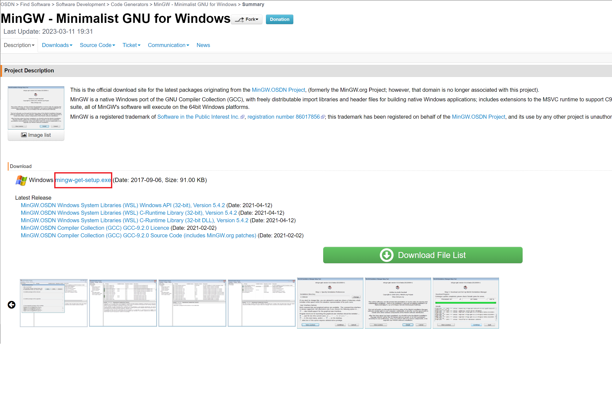
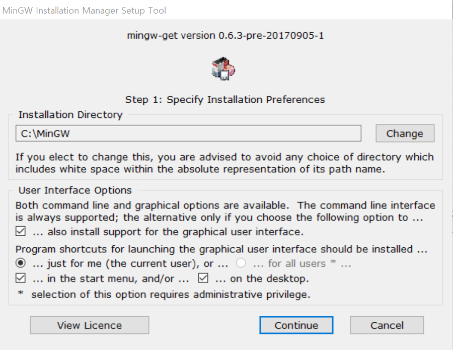
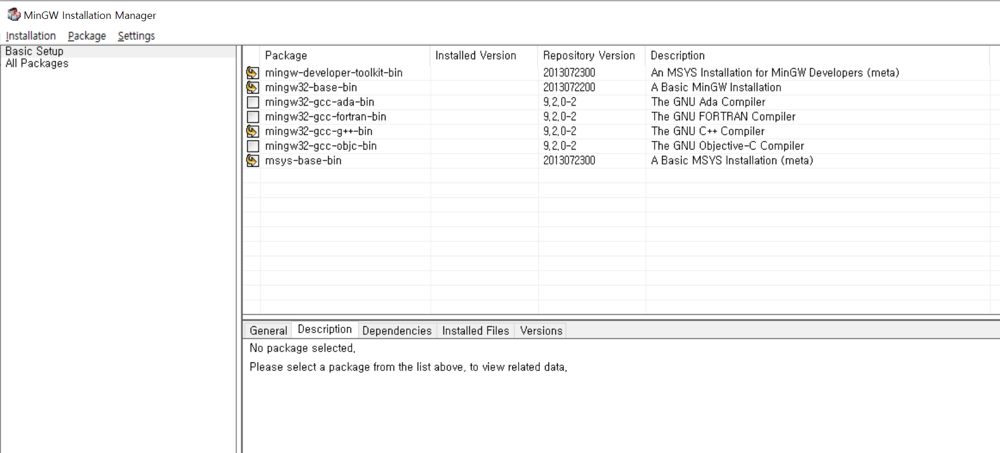
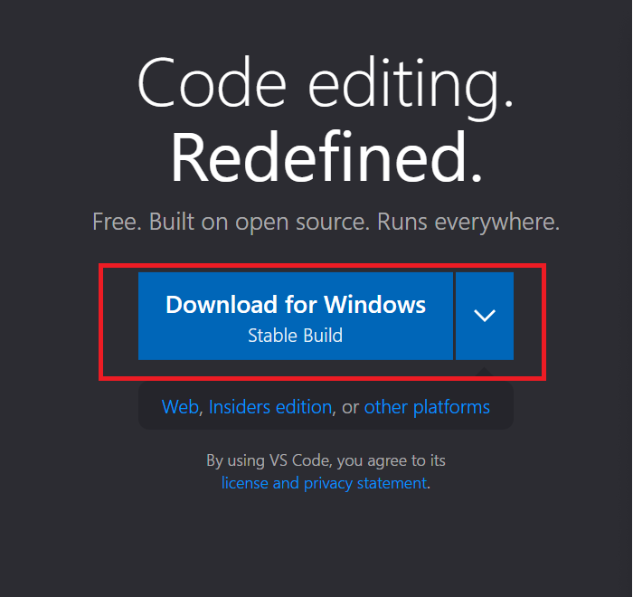
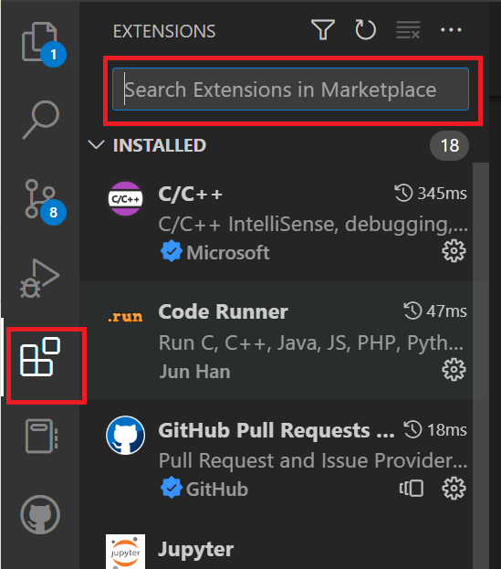
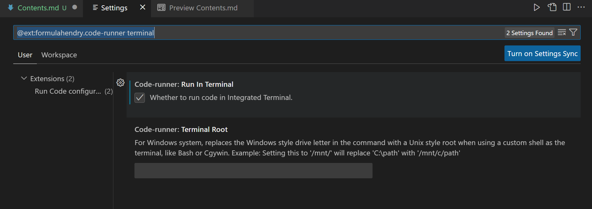
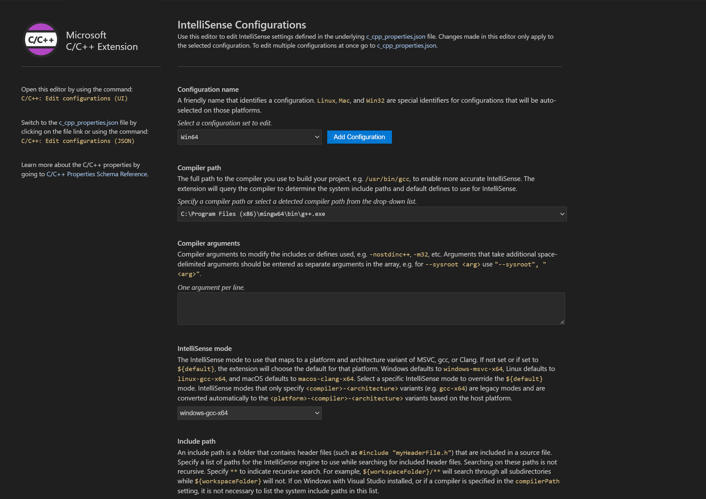
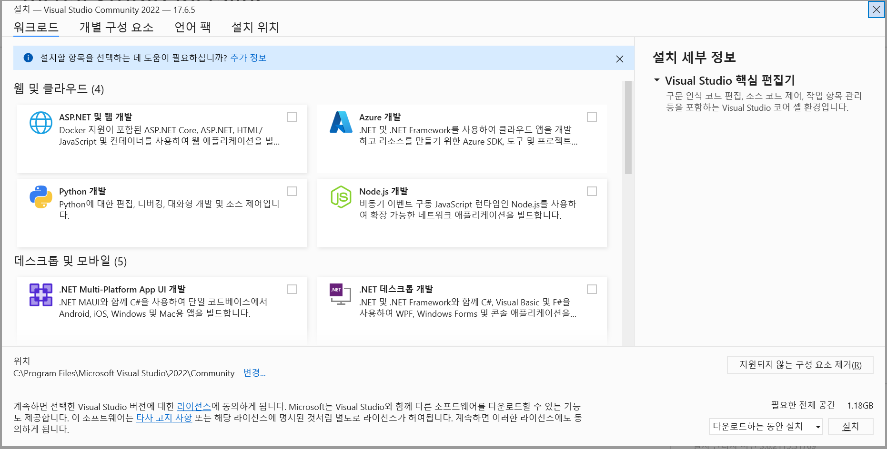

# 개발 환경 설정

> 1. GCC 컴파일러를 이용한 환경   
> - MinGW installer version (컴파일, 빌드 도구)   
[MinGW Link](https://osdn.net/projects/mingw/)
> - Visual Studio Code (텍스트 편집기)   
[VSCode Link](https://code.visualstudio.com/)

> 2. MSVC 컴파일러를 이용한 환경 
> - Visual Studio Community   
[VS Community Link](https://visualstudio.microsoft.com/ko/vs/pricing/?tab=individual)

- - - 

# 1. GCC 컴파일러를 이용한 환경

### 설정 순서
1. MinGW Installation manager 설치
2. MinGW Installation manager에서 Package 설치
3. 환경변수 설정

## 1. MinGW Installation manager 설치
</img>   
빨간 표시 링크 클릭. 설치 파일 다운로드하고 실행 이후 "Install" 버튼 클릭   

<br/>
<br/>

</img>   
위 화면에서 설치위치 지정하고 "Continue" 버튼 클릭   
!!! 설치 위치에 따라 환경변수 경로가 달라짐. 위 경로 복사해둘 것.   

<br/>
<br/>

## 2. MinGW Installation manager에서 설치할 Package 설치
</img>   
Installation manager에서 Package 4개에 각각 마우스 오른쪽 "Mark for Installation" 선택   
위와 같이 체크되어 있다면 왼쪽 상단 메뉴에서 "Installation -> Apply Changes",   
창 하나 뜨고 "Apply" 버튼 클릭하면 Package를 설치하는데 완료되면 설치 끝   

<br/>
<br/>

## 3. 환경변수 설정
Windows키(ctrl 옆의 키) + R 누르면 실행이라는 창이 나오고 "열기"에 **sysdm.cpl ,3** 입력 후 확인   
</img>   
위와 같은 창이 나오고 "환경 변수" 클릭   

<br/>
<br/>

</img>   
"시스템 변수"에서 변수 열의 "Path" 라고 되어있는 항목 누르고 "편집" 클릭   
"새로만들기" 하고 1번 항목에서 복사해둔 MinGW 경로를 붙여넣고 \bin 을 추가로 입력   

!!! 경로 수정 안했을때의 기본 경로
```
C:\MinGW\bin
```

<br/>
<br/>

- - -

# VSCode Setup   
설정 순서   
1. VSCode 설치
2. Extensions 설치
3. Extensions 설정
4. 폴더 생성

## 1. VSCode 설치
</img>   
Visual Studio Code 설치파일 다운로드 후 설치, 실행   

<br/>
<br/>

## 2. Extensions 설치
</img>   
사이드 바에서 Extensions를 누르고 위의 캡쳐의 검색창에 설치할 Extension 검색 후 "Install" 클릭   
아래 두개의 Extension 검색 후 설치
```
Code Runner
C/C++ extension pack
```

<br/>
<br/>

## 3. Extensions 설정

### Code Runner 설정
</img>   
상단 메뉴에서 "File -> Preferences -> Settings" (단축키 Ctrl + ,)   
Settings 창에서 상단의 Search settings에 아래의 문장 복사, 붙여넣기하면 위의 화면이 됨. 위의 Run In Terminal 옵션에 체크
```
@ext:formulahendry.code-runner RunInTerminal
```

<br/>
<br/>

### C/C++ 설정

VSCode창에서 Ctrl + Shift + P 키를 눌러 '명령어 팔레트' 상단에 호출    

C/C++: Edit Configurations(UI) 검색하고 선택   

- 설정화면   

</img>   

<br/>

Compliler Path    
**MinGW 파일 경로 \bin\g++.exe** 입력

IntelliSense mode   
**windows-gcc-x86** 선택


이제 Code runner extension을 이용하여 간편하게 실행하면 된다.

<br/>
<br/>

## 4. 폴더 생성 이후 코드 실행
상단 메뉴에서 "File -> Open Folder" 원하는 폴더 선택하고 해당 폴더에서 새폴더 만든 후 만든 폴더 이름 변경하고 폴더선택   
.c 확장자로 파일 생성, 코드 작성하고 해당 창에서 "마우스 오른쪽 클릭 -> Run Code" (단축키 Ctrl + Alt + N) 하시면 프로그램 실행가능 합니다.   


## 추가 선택 사항 : VSCode 디버깅

VSCode는 IDE(Integrated Development Environment/통합 개발 환경) 설정을 **.vscode** 폴더에 저장해 사용한다.   
디버깅은 해당 폴더에 있는 아래 설정 파일의 값을 조정하여 디버깅을 할 수 있게 한다.

.vscode 폴더의 ``launch.json``, ``tasks.json`` 두개의 파일을 옮겨 사용한다.   

디버깅은 빌드 -> 디버깅 순으로 실행되어야 한다.   

<br/>

### - launch.json

왼쪽 메뉴의 Run and Debug (또는 Ctrl + Shift + D)    
**Run and Debug** 버튼 -> launch.json 파일이 없을시 **Create a launch.json**로 launch.json 파일 생성
 

중간의 "miDebuggerPath" 인자 부분경로를 위의 컴파일러 경로(Compiler Path)로 변경     
! 컴파일러 경로가 있는 부분은 전부 자신의 환경에 맞추어 변경


### - tasks.json

중간의 "Command" 인자 부분경로를 위의 컴파일러 경로(Compiler Path)로 변경   
! 컴파일러 경로가 있는 부분은 전부 자신의 환경에 맞추어 변경
<br/>
<br/> 

# 2. MSVC 컴파일러를 이용한 환경 

### Visual Studio Community

visual Studio Community는 MSVC 컴파일러를 사용하여 VSCode에서 사용할 G++ 컴파일러와는 차이가 있을 수 있다.   
https://visualstudio.microsoft.com/ko/downloads/ 에서 Community 선택하여 설치하고 실행

- **Visual Studio Community 2022 Installer 화면**

</img>   

<br/>

### Visual Studio Installer의 상위 메뉴   

> **워크로드** : 개발 환경 템플릿(해당 플랫폼을 개발하기 위해 필요한 모음집 같은 것)을 선택해서 설치할 수 있음   
>
> **개별 구성 요소** : 개발 환경에서 부분적인 요소를 선택해서 설치할 수 있다. (잘 모르면 스킵)   
> 
> **언어 팩** : 한국어, 영어 둘 중 하나 선택해서 설치 
>
> **설치 위치** : 설치를 위해선 공간이 어느정도 필요하기 때문에 용량이 부족하다면 설치 위치를 변경해야 함.   


워크로드에서 자신의 목적에 맞게 아래의 것들을 체크하고 설치

- 필수항목   
C++을 사용한 데스크톱 개발    

- 선택항목   
.NET 데스크톱 개발 (.NET 프레임워크/C#/WPF/Windows Form 등을 독학 할 경우)   
Python 개발 (Visual Studio에서 Python도 이용할 경우)   


오른쪽 아래의 설치를 누르면 설치 시작


Visual Studio Community는 기본적으로 MSVC 컴파일러 사용

